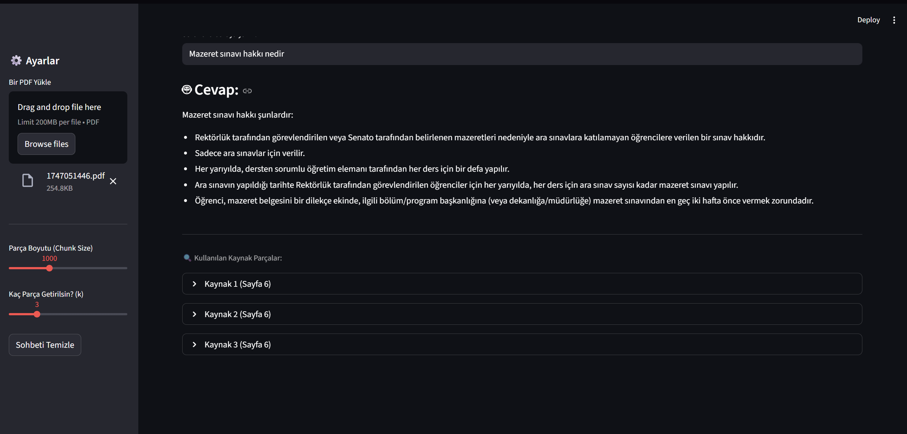
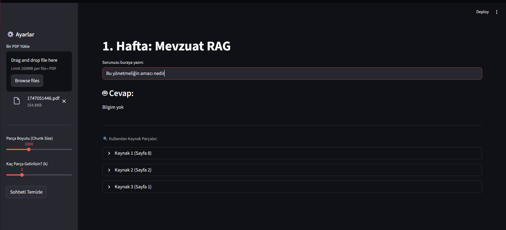

# 📄 Fırat Üniversitesi Mevzuat Asistanı (RAG Projesi - 1. Hafta)

Bu proje, **Tek Kaynaklı RAG (Retrieval-Augmented Generation)** mimarisini kullanarak, kullanıcıların yüklediği PDF dokümanları (özellikle mevzuat metinleri) ile sohbet etmesini sağlayan bir yapay zeka asistanıdır.

**Ders/Görev:** 1. Hafta — Tek Kaynaklı RAG Kurulumu

## 🚀 Projenin Amacı
Kullanıcı tarafından yüklenen uzun ve karmaşık PDF dosyalarını analiz etmek, kullanıcının sorularına belgeye dayalı, kaynak göstererek ve halüsinasyon (uydurma) yapmadan cevap vermek.

## ✨ Özellikler

* **PDF İşleme:** Yüklenen PDF dosyasını belirlenen karakter limitlerine (Chunk Size) göre parçalara ayırır.
* **Semantik Arama:** Sorulan soruyla en alakalı metin parçalarını **Vektör Veritabanı (ChromaDB)** üzerinden bulur.
* **Google Gemini Entegrasyonu:** En güncel **Gemini 2.5 Flash** modelini kullanarak akıcı ve Türkçe cevaplar üretir.
* **Kaynak Gösterimi:** Cevabın hangi sayfadan ve hangi parçadan alındığını şeffaf bir şekilde gösterir.
* **Ayarlanabilir Parametreler:**
    * `Chunk Size`: Metin parçalama boyutu.
    * `k Değeri`: Cevap için kaç parça metin kullanılacağı.
* **Kullanıcı Dostu Arayüz:** Streamlit ile geliştirilmiş modern ve hızlı arayüz.

## 🛠️ Kullanılan Teknolojiler

* **Dil:** Python 3.10
* **Arayüz:** Streamlit
* **Orkestrasyon:** LangChain (v0.2 Stable)
* **LLM & Embedding:** Google Gemini API (`gemini-2.5-flash`)
* **Veritabanı:** ChromaDB (Ephemeral/Bellek içi)

## 📸 Ekran Görüntüleri

### 1. Soru Cevap ve Kaynak Gösterimi
Kullanıcı "Mazeret sınavı hakkı nedir?" diye sorduğunda sistemin verdiği kaynaklı cevap:






### 2. Ayarlar ve Doküman Yükleme
PDF yükleme alanı ve Chunk/k ayarları:


## ⚙️ Kurulum ve Çalıştırma

Projeyi kendi bilgisayarınızda çalıştırmak için aşağıdaki adımları izleyin:

1.  **Gereksinimleri Yükleyin:**
    ```bash
    pip install -r requirements.txt
    ```

2.  **API Anahtarını Ayarlayın:**
    `app.py` dosyası içerisine Google AI Studio'dan aldığınız API anahtarını ekleyin.

3.  **Uygulamayı Başlatın:**
    Terminalde şu komutu çalıştırın:
    ```bash
    streamlit run app.py
    ```

## 🧪 Test Edilen Senaryolar (1. Hafta)

* [x] PDF yükleme ve metin parçalama (Chunking).
* [x] Vektör veritabanına kayıt.
* [x] "Bağlamda yoksa uydurma" kuralının uygulanması.
* [x] Cevapların madde madde listelenmesi.
* [x] Cevabın dayandığı kaynakların (Sayfa no) gösterilmesi.

---
